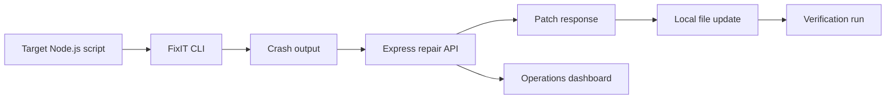

<div align="center">

# FixIT

**A developer-operations prototype for incident simulation, guided remediation, and crash-recovery workflows.**

<p>
  
  
  
  
</p>

<p>
  <a href="#overview">Overview</a> ·
  <a href="#capabilities">Capabilities</a> ·
  <a href="#architecture">Architecture</a> ·
  <a href="#getting-started">Setup</a> ·
  <a href="#project-status">Status</a>
</p>

</div>

---

## Overview

FixIT explores how a developer-facing console and terminal agent can work together during software failures. The web application presents service health, system logs, incident scenarios, and remediation actions. The companion CLI runs a Node.js script, captures a crash, submits the source and error output to a repair endpoint, applies the returned patch, and executes the script again for verification.

The current repository is a prototype. Its incident state and several repair operations are simulated, making it suitable for demonstrating the workflow and interface rather than operating production infrastructure.

## Capabilities

| Capability | Description |
|---|---|
| Operations console | Presents service status, logs, incidents, and resolution activity |
| Incident simulation | Models service crashes, database connection exhaustion, and memory pressure |
| Repair API | Accepts source code and error context through `/api/fix` |
| CLI recovery loop | Runs a script, captures `stderr`, requests a patch, rewrites the file, and verifies execution |
| Guided remediation | Exposes restart, connection reset, code patch, and health-check operations |
| Interactive interface | Uses motion and WebGL elements for system-state visualization |

## Architecture



## Technology

| Layer | Technologies |
|---|---|
| Web interface | React 19, TypeScript, Vite, Tailwind CSS |
| Motion and graphics | Motion, Three.js, React Three Fiber |
| Application server | Express, CORS, tsx |
| Authentication and data | Firebase Authentication, Firestore |
| CLI | Commander, Axios, Chalk, Ora, fs-extra |
| AI integration | Google GenAI dependency and configurable repair endpoint |

## Repository layout

```text
.
|-- src/             React operations console
|-- public/          Static CLI and application assets
|-- cli/             Minimal crash-recovery client
|-- cli-tool/        Extended terminal client and test crash
|-- server.ts        API routes and simulated system state
|-- .env.example     Environment template
`-- package.json     Web and server scripts
```

## Getting started

### Web application

```bash
git clone https://github.com/codingyash9-bit/FIxIT.git
cd FIxIT
npm install
```

Create a local environment file:

```bash
cp .env.example .env
```

Configure the required values, then start the application:

```bash
npm run dev
```

The server is configured to use port `3000`.

### CLI prototype

```bash
cd cli-tool
npm install
node index.js auto test-crash.js
```

Set `FIXIT_API_URL` when the repair API is running at a different address.

```bash
FIXIT_API_URL=http://localhost:3000/api/fix node index.js auto test-crash.js
```

> [!WARNING]
> The CLI replaces the supplied file with the patch returned by the API. Run it only on committed, backed-up, or disposable files.

## Available scripts

| Command | Purpose |
|---|---|
| `npm run dev` | Start the Express and Vite development server |
| `npm run build` | Create the production frontend bundle |
| `npm run preview` | Preview the Vite production build |
| `npm run lint` | Run TypeScript validation without emitting files |

## Project status

| Area | State |
|---|---|
| Incident dashboard | Implemented prototype |
| Simulated service state | Implemented |
| CLI crash capture | Implemented |
| Patch application and rerun | Implemented |
| Production infrastructure adapters | Not implemented |
| Sandboxed patch execution | Not implemented |
| Automated test suite | Pending |

## Safety and limitations

- Incident data is held in process memory and resets when the server restarts.
- The current repair endpoint contains demonstration-level transformation logic.
- Patched programs are executed directly on the local machine without sandboxing.
- The CLI currently targets Node.js scripts.
- Production usage requires authentication, authorization, audit logging, isolation, rollback, and stronger validation.

---

<div align="center">
  <sub>Designed and developed by <a href="https://github.com/codingyash9-bit">Yash Mahadeshvar</a>.</sub>
</div>
